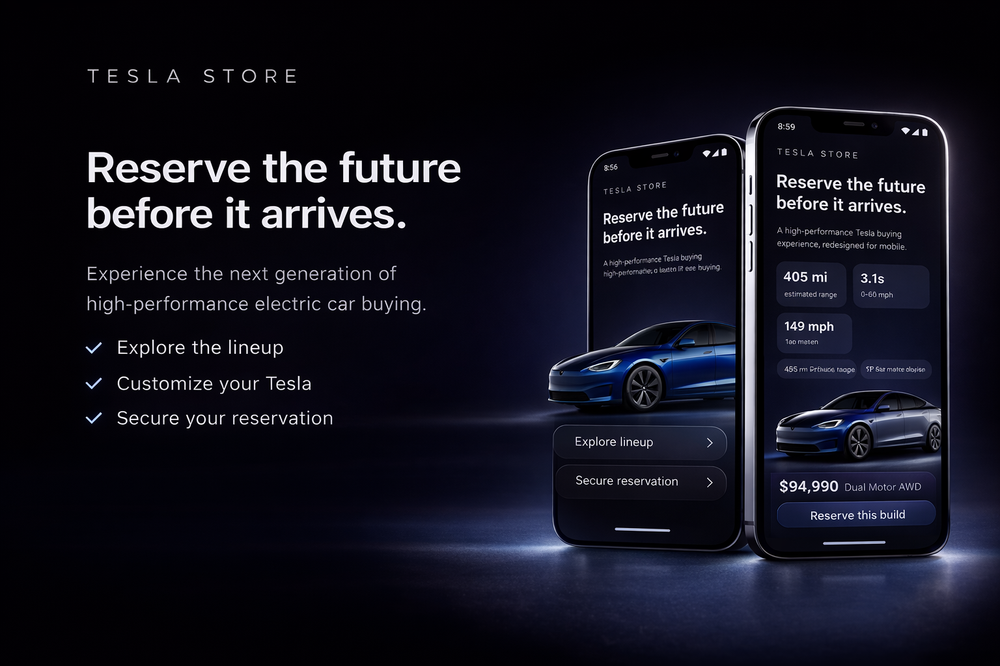
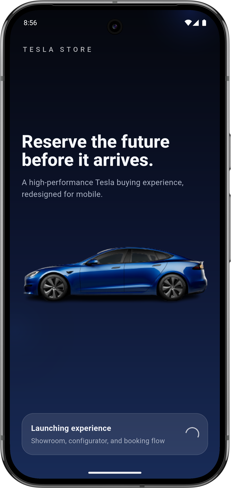
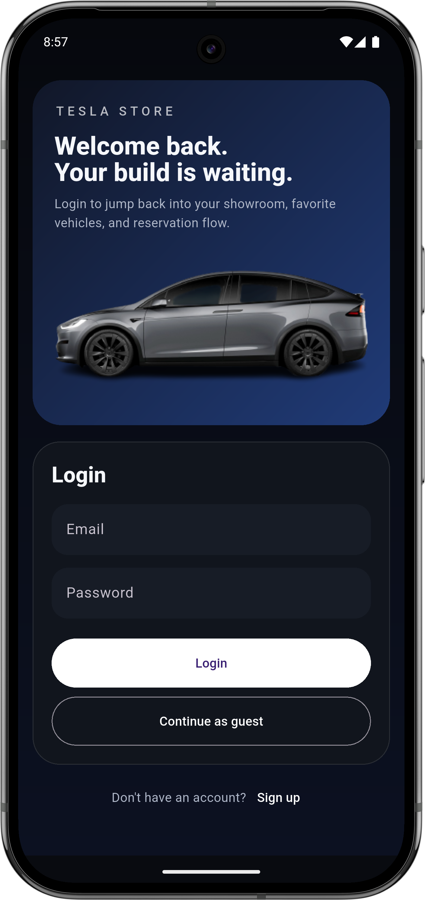
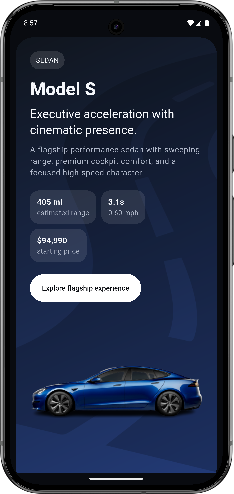
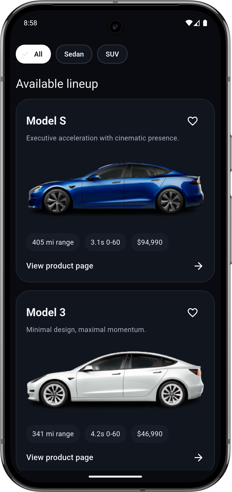
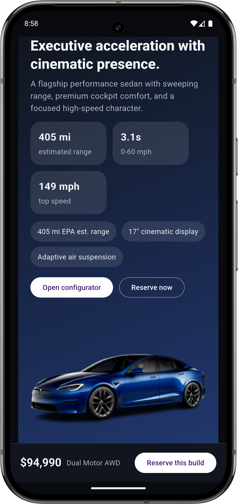
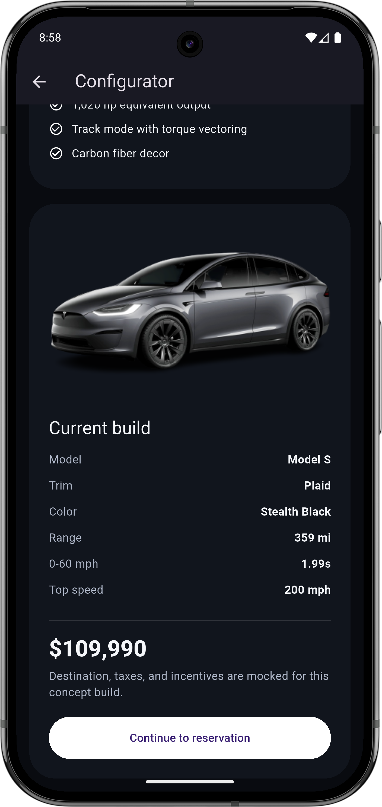

# Tesla Store ⚡



A premium, cinematic Tesla-inspired vehicle showroom and reservation application built with Flutter. Experience the future of EV purchasing with a high-performance, mobile-first design.

### 🔗 [Live Demo (Vercel)](https://tesla-store.vercel.app)

---

## ✨ Features

- **Cinematic Showroom**: High-quality visuals showcasing the Tesla fleet.
- **Dynamic Customization**: Real-time color updates and wheel selection.
- **Detailed Specifications**: Comprehensive performance metrics and feature highlights.
- **Seamless Reservation**: An elegant booking flow for your future vehicle.
- **Responsive Design**: Optimized for mobile and web using Flutter.

## 📱 App Highlights

<p align="center">
  
  
  
</p>

<p align="center">
  <i>Onboarding • Authentication • Showroom</i>
</p>

<p align="center">
  
  
  
</p>

<p align="center">
  <i>Specifications • Color Customizer • Interior Details</i>
</p>

---

## 🛠 Tech Stack

- **Framework**: [Flutter](https://flutter.dev)
- **State Management**: Provider / SetState (as per architecture)
- **UI Components**: Custom-built premium widgets
- **Deployment**: [Vercel](https://vercel.com)
- **Testing**: [Device Preview](https://pub.dev/packages/device_preview) for multi-device simulation

## 🚀 Getting Started

### Prerequisites
- Flutter SDK (>=3.0.5)
- Android Studio / VS Code

### Installation
1. Clone the repository:
   ```bash
   git clone https://github.com/yadavcodes0/tesla_store.git
   ```
2. Fetch dependencies:
   ```bash
   flutter pub get
   ```
3. Run the application:
   ```bash
   flutter run
   ```

---

## 📄 License

Distributed under the MIT License. See `LICENSE` for more information.

---
<p align="center">
  Proudly developed for the future of sustainable energy. 🏎️🔋
</p>